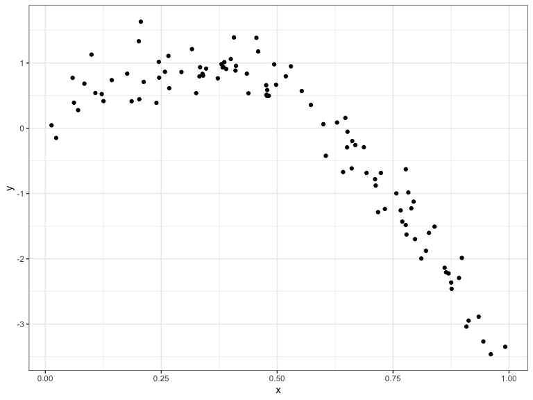
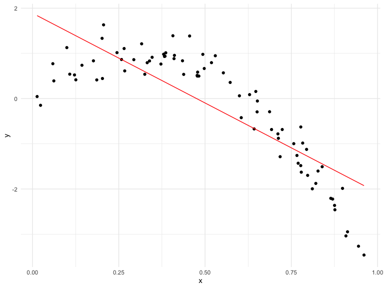
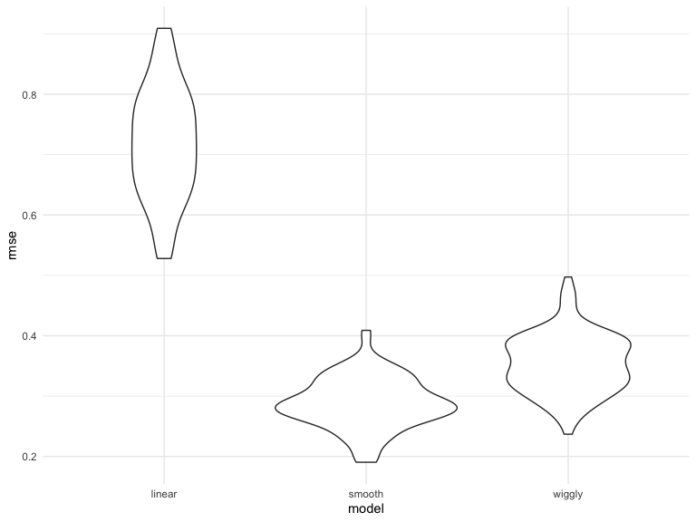
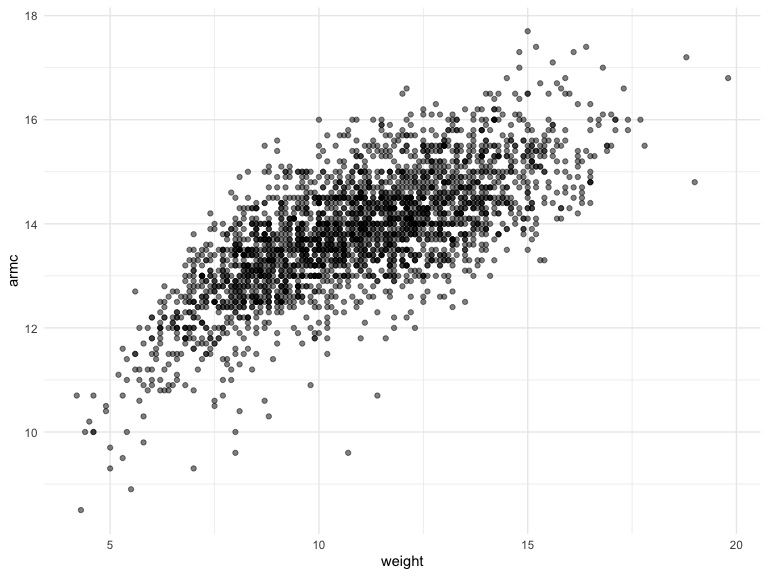

cross\_validation
================
Ashley Tseng
11/12/2019

## Cross Validation “by hand”

``` r
nonlin_df = 
  tibble(
    id = 1:100,
    x = runif(100, 0, 1),
    y = 1 - 10 * (x - .3) ^ 2 + rnorm(100, 0, .3)
  )

nonlin_df %>% 
  ggplot(aes(x = x, y = y)) + 
  geom_point() + theme_bw()
```



Training and testing

``` r
train_df = sample_frac(nonlin_df, size = .8)
test_df = anti_join(nonlin_df, train_df, by = "id")

ggplot(train_df, aes(x = x, y = y)) + 
  geom_point() + 
  geom_point(data = test_df, color = "red")
```


Fit three models of varying goodness

``` r
linear_mod = lm(y ~ x, data = train_df)
smooth_mod = mgcv::gam(y ~ s(x), data = train_df)
wiggly_mod = mgcv::gam(y ~ s(x, k = 30), sp = 10e-6, data = train_df)
```

### Let’s look at some fits

Linear Model:

``` r
linear_plot = train_df %>% 
  add_predictions(linear_mod) %>% 
  ggplot(aes(x = x, y = y)) + 
  geom_point() + 
  geom_line(aes(y = pred), color = "red")

linear_plot
```


Just eyeballing this, this is not a good fit. The line we get from the
linear prediction model does not fit the data well.

Smooth Model:

``` r
smooth_plot = train_df %>% 
  add_predictions(smooth_mod) %>% 
  ggplot(aes(x = x, y = y)) + 
  geom_point() + 
  geom_line(aes(y = pred), color = "red")

smooth_plot
```


This is a good fit.

Wiggly Model:

``` r
wiggly_plot = train_df %>% 
  add_predictions(wiggly_mod) %>% 
  ggplot(aes(x = x, y = y)) + 
  geom_point() + 
  geom_line(aes(y = pred), color = "red")

wiggly_plot
```


This is worse than the smooth model but not the worst in the world. It’s
better than the linear model.

Test dataset:

``` r
rmse(linear_mod, test_df)
```

    ## [1] 0.7052956

``` r
rmse(smooth_mod, test_df)
```

    ## [1] 0.2221774

``` r
rmse(wiggly_mod, test_df)
```

    ## [1] 0.289051

Train dataset:

``` r
rmse(linear_mod, train_df)
```

    ## [1] 0.7178747

``` r
rmse(smooth_mod, train_df)
```

    ## [1] 0.2874834

``` r
rmse(wiggly_mod, train_df)
```

    ## [1] 0.2498309

**You will always pick the model that fits the test dataset better. The
training dataset you normally put too much stuff in; it may look lke
it’s looking better than the test dataset, but in reality it’s not.
Similar to how adding more covariates to your model increases R^2
always.**

When would wiggly models come in handy? E.g., if I have 40 different
environmental pollutants and don’t know which one is the worst, I would
use cross validation and run different models (linear, smooth, wiggly).

## Now we will do CV using modelr

``` r
cv_df = 
  crossv_mc(nonlin_df, 100) 
```

One note about resample… The way that CV works behind the scenes:
Doesn’t save all the train and test datasets to be less
memory-intensive.

``` r
cv_df %>% 
  pull(train) %>% 
  .[[1]] %>% 
  as_tibble
```

    ## # A tibble: 79 x 3
    ##       id      x       y
    ##    <int>  <dbl>   <dbl>
    ##  1     1 0.266   1.11  
    ##  2     2 0.372   0.764 
    ##  3     3 0.573   0.358 
    ##  4     4 0.908  -3.04  
    ##  5     6 0.898  -1.99  
    ##  6     7 0.945  -3.27  
    ##  7     8 0.661  -0.615 
    ##  8     9 0.629   0.0878
    ##  9    10 0.0618  0.392 
    ## 10    11 0.206   1.63  
    ## # … with 69 more rows

``` r
cv_df %>% 
  pull(test) %>% 
  .[[1]] %>% 
  as_tibble
```

    ## # A tibble: 21 x 3
    ##       id      x      y
    ##    <int>  <dbl>  <dbl>
    ##  1     5 0.202   1.33 
    ##  2    12 0.177   0.836
    ##  3    19 0.380   0.982
    ##  4    22 0.212   0.710
    ##  5    28 0.382   0.932
    ##  6    31 0.482   0.498
    ##  7    37 0.794  -1.12 
    ##  8    42 0.647   0.158
    ##  9    47 0.0233 -0.148
    ## 10    56 0.0995  1.13 
    ## # … with 11 more rows

``` r
cv_df =
  cv_df %>% 
  mutate(
    train = map(train, as_tibble),
    test = map(test, as_tibble))
```

Try fitting the linear model to all of these:

``` r
cv_df = 
  cv_df %>% 
  mutate(linear_mods  = map(.x = train, ~lm(y ~ x, data = .x)),
         smooth_mods  = map(.x = train, ~mgcv::gam(y ~ s(x), data = .x)),
         wiggly_mods  = map(.x = train, ~gam(y ~ s(x, k = 30), sp = 10e-6, data = .x))) %>% 
  mutate(rmse_linear = map2_dbl(.x = linear_mods, .y = test, ~rmse(model = .x, data = .y)),
         rmse_smooth = map2_dbl(.x = smooth_mods, .y = test, ~rmse(model = .x, data = .y)),
         rmse_wiggly = map2_dbl(.x = wiggly_mods, .y = test, ~rmse(model = .x, data = .y)))
```

To get RMSE, you need to map over 2 columns (hence use map2).

Plot the distribution of RMSE values for each candidate model:

``` r
cv_df %>% 
  select(starts_with("rmse")) %>% 
  pivot_longer(
    everything(),
    names_to = "model", 
    values_to = "rmse",
    names_prefix = "rmse_") %>% 
  mutate(model = fct_inorder(model)) %>% 
  ggplot(aes(x = model, y = rmse)) + geom_violin()
```



## Example: Child Growth

``` r
child_growth = read_csv("./data/nepalese_children.csv")
```

    ## Parsed with column specification:
    ## cols(
    ##   age = col_double(),
    ##   sex = col_double(),
    ##   weight = col_double(),
    ##   height = col_double(),
    ##   armc = col_double()
    ## )

``` r
child_growth %>% 
  ggplot(aes(x = weight, y = armc)) + 
  geom_point(alpha = .5)
```


Based on visually inspecting the plot, there is maaaybe not a straight
line. If we tried to draw a line through the points, we would probbaly
curve it.
