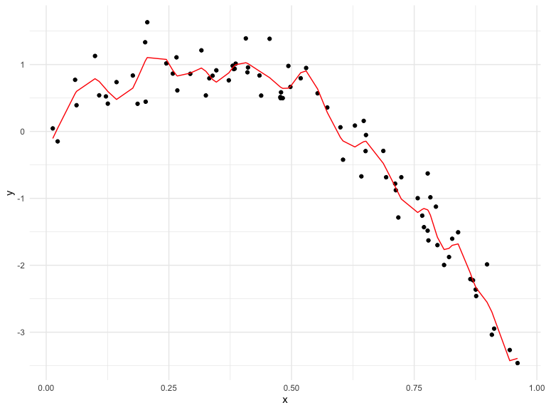

cross\_validation
================
Ashley Tseng
11/12/2019

## Cross Validation “by hand”

``` r
nonlin_df = 
  tibble(
    id = 1:100,
    x = runif(100, 0, 1),
    y = 1 - 10 * (x - .3) ^ 2 + rnorm(100, 0, .3)
  )

nonlin_df %>% 
  ggplot(aes(x = x, y = y)) + 
  geom_point() + theme_bw()
```


Training and testing

``` r
train_df = sample_frac(nonlin_df, size = .8)
test_df = anti_join(nonlin_df, train_df, by = "id")

ggplot(train_df, aes(x = x, y = y)) + 
  geom_point() + 
  geom_point(data = test_df, color = "red")
```


Fit three models of varying goodness

``` r
linear_mod = lm(y ~ x, data = train_df)
smooth_mod = mgcv::gam(y ~ s(x), data = train_df)
wiggly_mod = mgcv::gam(y ~ s(x, k = 30), sp = 10e-6, data = train_df)
```

### Let’s look at some fits

Linear Model:

``` r
linear_plot = train_df %>% 
  add_predictions(linear_mod) %>% 
  ggplot(aes(x = x, y = y)) + 
  geom_point() + 
  geom_line(aes(y = pred), color = "red")

linear_plot
```


Just eyeballing this, this is not a good fit. The line we get from the
linear prediction model does not fit the data well.

Smooth Model:

``` r
smooth_plot = train_df %>% 
  add_predictions(smooth_mod) %>% 
  ggplot(aes(x = x, y = y)) + 
  geom_point() + 
  geom_line(aes(y = pred), color = "red")

smooth_plot
```


This is a good fit.

Wiggly Model:

``` r
wiggly_plot = train_df %>% 
  add_predictions(wiggly_mod) %>% 
  ggplot(aes(x = x, y = y)) + 
  geom_point() + 
  geom_line(aes(y = pred), color = "red")

wiggly_plot
```


This is worse than the smooth model but not the worst in the world. It’s
better than the linear model.

Test dataset:

``` r
rmse(linear_mod, test_df)
```

    ## [1] 0.7052956

``` r
rmse(smooth_mod, test_df)
```

    ## [1] 0.2221774

``` r
rmse(wiggly_mod, test_df)
```

    ## [1] 0.289051

Train dataset:

``` r
rmse(linear_mod, train_df)
```

    ## [1] 0.7178747

``` r
rmse(smooth_mod, train_df)
```

    ## [1] 0.2874834

``` r
rmse(wiggly_mod, train_df)
```

    ## [1] 0.2498309

**You will always pick the model that fits the test dataset better. The
training dataset you normally put too much stuff in; it may look lke
it’s looking better than the test dataset, but in reality it’s not.
Similar to how adding more covariates to your model increases R^2
always.**
