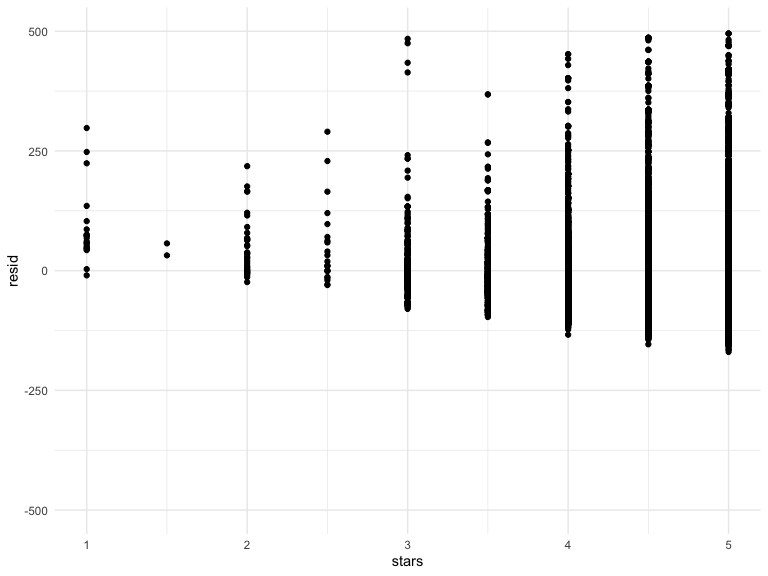

linear\_models
================
Ashley Tseng
11/7/2019

## Model Fitting

``` r
data("nyc_airbnb")

nyc_airbnb = 
  nyc_airbnb %>% 
  mutate(stars = review_scores_location / 2) %>% 
  rename(
    boro = neighbourhood_group,
    neighborhood = neighbourhood) %>% 
  filter(boro != "Staten Island") %>% 
  select(price, stars, boro, neighborhood, room_type)
```

Fit first linear model\!

``` r
fit = lm(price ~ stars + boro, data = nyc_airbnb)

summary(fit)
```

    ## 
    ## Call:
    ## lm(formula = price ~ stars + boro, data = nyc_airbnb)
    ## 
    ## Residuals:
    ##    Min     1Q Median     3Q    Max 
    ## -169.8  -64.0  -29.0   20.2 9870.0 
    ## 
    ## Coefficients:
    ##               Estimate Std. Error t value Pr(>|t|)    
    ## (Intercept)    -70.414     14.021  -5.022 5.14e-07 ***
    ## stars           31.990      2.527  12.657  < 2e-16 ***
    ## boroBrooklyn    40.500      8.559   4.732 2.23e-06 ***
    ## boroManhattan   90.254      8.567  10.534  < 2e-16 ***
    ## boroQueens      13.206      9.065   1.457    0.145    
    ## ---
    ## Signif. codes:  0 '***' 0.001 '**' 0.01 '*' 0.05 '.' 0.1 ' ' 1
    ## 
    ## Residual standard error: 181.5 on 30525 degrees of freedom
    ##   (9962 observations deleted due to missingness)
    ## Multiple R-squared:  0.03423,    Adjusted R-squared:  0.03411 
    ## F-statistic: 270.5 on 4 and 30525 DF,  p-value: < 2.2e-16

Tidy the results

``` r
fit %>% 
  broom::tidy() %>% 
  mutate(term = str_replace(term, "boro", "Boro: ")) %>% 
  knitr::kable(digits = 3)
```

| term            | estimate | std.error | statistic | p.value |
| :-------------- | -------: | --------: | --------: | ------: |
| (Intercept)     | \-70.414 |    14.021 |   \-5.022 |   0.000 |
| stars           |   31.990 |     2.527 |    12.657 |   0.000 |
| Boro: Brooklyn  |   40.500 |     8.559 |     4.732 |   0.000 |
| Boro: Manhattan |   90.254 |     8.567 |    10.534 |   0.000 |
| Boro: Queens    |   13.206 |     9.065 |     1.457 |   0.145 |

## Take a look at factors

Changing reference group:

``` r
nyc_airbnb = 
  nyc_airbnb %>% 
  mutate(
    boro = fct_infreq(boro, ordered = NA),
    room_type = fct_infreq(room_type))
```

Refit the last model

``` r
fit = lm(price ~ stars + boro, data = nyc_airbnb)
```

Tidy

``` r
fit %>% 
  broom::tidy() %>% 
  mutate(term = str_replace(term, "boro", "Boro: ")) %>% 
  knitr::kable(digits = 3)
```

| term           | estimate | std.error | statistic | p.value |
| :------------- | -------: | --------: | --------: | ------: |
| (Intercept)    |   19.839 |    12.189 |     1.628 |   0.104 |
| stars          |   31.990 |     2.527 |    12.657 |   0.000 |
| Boro: Brooklyn | \-49.754 |     2.235 |  \-22.262 |   0.000 |
| Boro: Queens   | \-77.048 |     3.727 |  \-20.675 |   0.000 |
| Boro: Bronx    | \-90.254 |     8.567 |  \-10.534 |   0.000 |

## Diagnostics

Looking at what’s going on with residuals

``` r
residuals_violin = 
  modelr::add_residuals(nyc_airbnb, fit) %>% 
  ggplot(aes(x = boro, y = resid)) +
  geom_violin() +
  ylim(-500, 500)

residuals_violin
```


``` r
residuals_scatter = 
  modelr::add_residuals(nyc_airbnb, fit) %>% 
  ggplot(aes(x = stars, y = resid)) +
  geom_point() +
  ylim(-500, 500)

residuals_scatter
```



add\_predictions is just plugging the values into the regression
equation and spitting out the value. add\_predictions is the same
structure as add\_residuals:

``` r
modelr::add_predictions(nyc_airbnb, fit)
```

    ## # A tibble: 40,492 x 6
    ##    price stars boro  neighborhood room_type        pred
    ##    <dbl> <dbl> <fct> <chr>        <fct>           <dbl>
    ##  1    99   5   Bronx City Island  Private room     89.5
    ##  2   200  NA   Bronx City Island  Private room     NA  
    ##  3   300  NA   Bronx City Island  Entire home/apt  NA  
    ##  4   125   5   Bronx City Island  Entire home/apt  89.5
    ##  5    69   5   Bronx City Island  Private room     89.5
    ##  6   125   5   Bronx City Island  Entire home/apt  89.5
    ##  7    85   5   Bronx City Island  Entire home/apt  89.5
    ##  8    39   4.5 Bronx Allerton     Private room     73.5
    ##  9    95   5   Bronx Allerton     Entire home/apt  89.5
    ## 10   125   4.5 Bronx Allerton     Entire home/apt  73.5
    ## # … with 40,482 more rows

## Skipping Hypothesis Testing

## Nesting Data

``` r
fit_interaction = lm(price ~ stars * boro, data = nyc_airbnb)

fit_interaction %>% 
  broom::tidy()
```

    ## # A tibble: 8 x 5
    ##   term               estimate std.error statistic  p.value
    ##   <chr>                 <dbl>     <dbl>     <dbl>    <dbl>
    ## 1 (Intercept)           -34.3     19.8     -1.73  8.34e- 2
    ## 2 stars                  43.3      4.13    10.5   1.05e-25
    ## 3 boroBrooklyn           23.0     25.9      0.887 3.75e- 1
    ## 4 boroQueens             52.4     41.8      1.25  2.10e- 1
    ## 5 boroBronx              84.2     80.2      1.05  2.93e- 1
    ## 6 stars:boroBrooklyn    -15.3      5.46    -2.81  5.02e- 3
    ## 7 stars:boroQueens      -27.5      8.90    -3.09  2.00e- 3
    ## 8 stars:boroBronx       -38.4     17.9     -2.15  3.16e- 2

In the Bronx and in Queens, it almost doesn’t matter what the number of
stars the airbnb has is. In Manhattan, it will depend a lot on the
number of
stars.

``` r
fit_interaction = lm(price ~ stars * boro + room_type * boro, data = nyc_airbnb)

fit_interaction %>% 
  broom::tidy()
```

    ## # A tibble: 16 x 5
    ##    term                               estimate std.error statistic  p.value
    ##    <chr>                                 <dbl>     <dbl>     <dbl>    <dbl>
    ##  1 (Intercept)                           95.7      19.2     4.99   6.13e- 7
    ##  2 stars                                 27.1       3.96    6.84   8.20e-12
    ##  3 boroBrooklyn                         -26.1      25.1    -1.04   2.99e- 1
    ##  4 boroQueens                            -4.12     40.7    -0.101  9.19e- 1
    ##  5 boroBronx                             -5.63     77.8    -0.0723 9.42e- 1
    ##  6 room_typePrivate room               -124.        3.00  -41.5    0.      
    ##  7 room_typeShared room                -154.        8.69  -17.7    1.42e-69
    ##  8 stars:boroBrooklyn                    -6.14      5.24   -1.17   2.41e- 1
    ##  9 stars:boroQueens                     -17.5       8.54   -2.04   4.09e- 2
    ## 10 stars:boroBronx                      -22.7      17.1    -1.33   1.85e- 1
    ## 11 boroBrooklyn:room_typePrivate room    32.0       4.33    7.39   1.55e-13
    ## 12 boroQueens:room_typePrivate room      54.9       7.46    7.37   1.81e-13
    ## 13 boroBronx:room_typePrivate room       71.3      18.0     3.96   7.54e- 5
    ## 14 boroBrooklyn:room_typeShared room     47.8      13.9     3.44   5.83e- 4
    ## 15 boroQueens:room_typeShared room       58.7      17.9     3.28   1.05e- 3
    ## 16 boroBronx:room_typeShared room        83.1      42.5     1.96   5.03e- 2

In Manhattan, a shared room is going to cost you on average $154 less.

``` r
nyc_airbnb %>% 
  lm(price ~ stars * boro + room_type * boro, data = .) %>% 
  broom::tidy() %>% 
  knitr::kable(digits = 3)
```

| term                                |  estimate | std.error | statistic | p.value |
| :---------------------------------- | --------: | --------: | --------: | ------: |
| (Intercept)                         |    95.694 |    19.184 |     4.988 |   0.000 |
| stars                               |    27.110 |     3.965 |     6.838 |   0.000 |
| boroBrooklyn                        |  \-26.066 |    25.080 |   \-1.039 |   0.299 |
| boroQueens                          |   \-4.118 |    40.674 |   \-0.101 |   0.919 |
| boroBronx                           |   \-5.627 |    77.808 |   \-0.072 |   0.942 |
| room\_typePrivate room              | \-124.188 |     2.996 |  \-41.457 |   0.000 |
| room\_typeShared room               | \-153.635 |     8.692 |  \-17.676 |   0.000 |
| stars:boroBrooklyn                  |   \-6.139 |     5.237 |   \-1.172 |   0.241 |
| stars:boroQueens                    |  \-17.455 |     8.539 |   \-2.044 |   0.041 |
| stars:boroBronx                     |  \-22.664 |    17.099 |   \-1.325 |   0.185 |
| boroBrooklyn:room\_typePrivate room |    31.965 |     4.328 |     7.386 |   0.000 |
| boroQueens:room\_typePrivate room   |    54.933 |     7.459 |     7.365 |   0.000 |
| boroBronx:room\_typePrivate room    |    71.273 |    18.002 |     3.959 |   0.000 |
| boroBrooklyn:room\_typeShared room  |    47.797 |    13.895 |     3.440 |   0.001 |
| boroQueens:room\_typeShared room    |    58.662 |    17.897 |     3.278 |   0.001 |
| boroBronx:room\_typeShared room     |    83.089 |    42.451 |     1.957 |   0.050 |

Let’s try to map this instead.

``` r
nest_lm_res =
  nyc_airbnb %>% 
  nest(data = -boro) %>% 
  mutate(models = map(.x = data, ~lm(price ~ stars + room_type, data = .x)),
         models = map(models, broom::tidy)) %>% 
  select(-data) %>% 
  unnest(models)
```

Going from an entire home to a shared room in Manhattan will cost you
$154 less and $106 less in Brooklyn.

Let’s nest neighborhoods:

``` r
manhattan_nest_lm_res =
  nyc_airbnb %>% 
  filter(boro == "Manhattan") %>% 
  nest(data = -neighborhood) %>% 
  mutate(models = map(.x = data, ~lm(price ~ stars + room_type, data = .x)),
         models = map(models, broom::tidy)) %>% 
  select(-data) %>% 
  unnest(models)

MH_nest_plot = manhattan_nest_lm_res %>% 
  filter(str_detect(term, "room_type")) %>% 
  ggplot(aes(x = neighborhood, y = estimate)) + 
  geom_point() + 
  facet_wrap(~term) + 
  theme(axis.text.x = element_text(angle = 80, hjust = 1))

MH_nest_plot
```


Private rooms are on the left, shared rooms are on the right. In Battery
Park city, private rooms are less expensive than an entire home (~$100
less). In NoHo, it’s $200 less to stay in a private room than an entire
home.

``` r
nyc_airbnb %>% 
  filter(neighborhood == "Murray Hill", room_type == "Shared room")
```

    ## # A tibble: 8 x 5
    ##   price stars boro      neighborhood room_type  
    ##   <dbl> <dbl> <fct>     <chr>        <fct>      
    ## 1   150   5   Manhattan Murray Hill  Shared room
    ## 2   200  NA   Manhattan Murray Hill  Shared room
    ## 3   100  NA   Manhattan Murray Hill  Shared room
    ## 4   103   4.5 Manhattan Murray Hill  Shared room
    ## 5   115   5   Manhattan Murray Hill  Shared room
    ## 6    75   5   Manhattan Murray Hill  Shared room
    ## 7   120   5   Manhattan Murray Hill  Shared room
    ## 8   160  NA   Manhattan Murray Hill  Shared room

Great for exploratory analysis, but not a formal analysis
